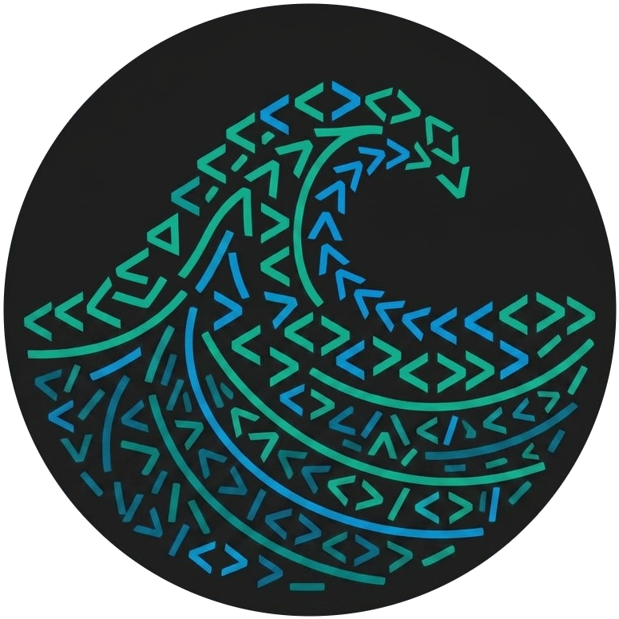
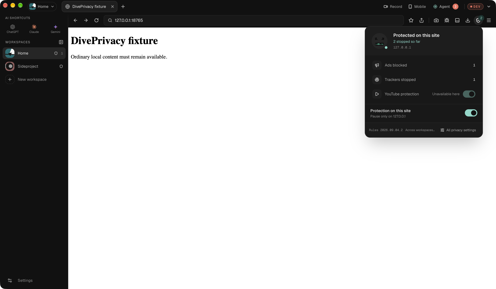
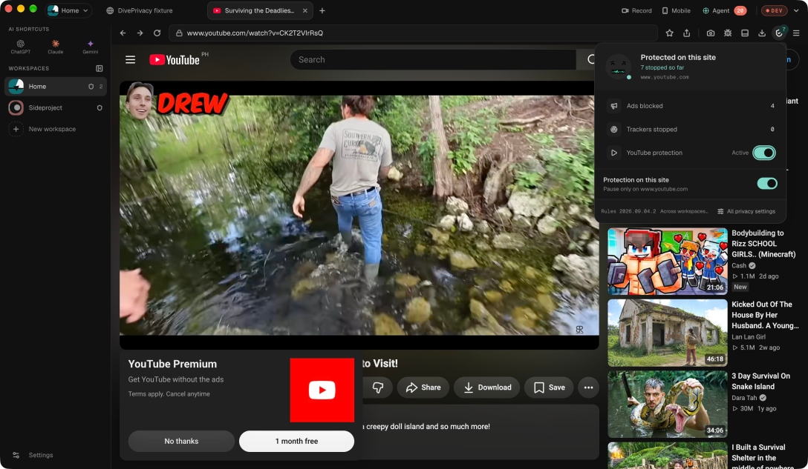
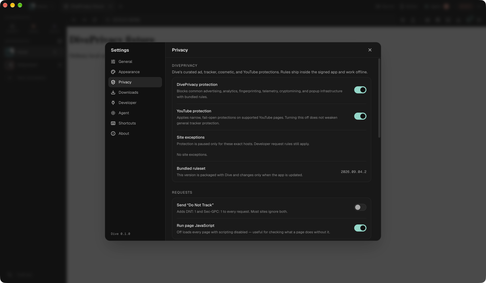
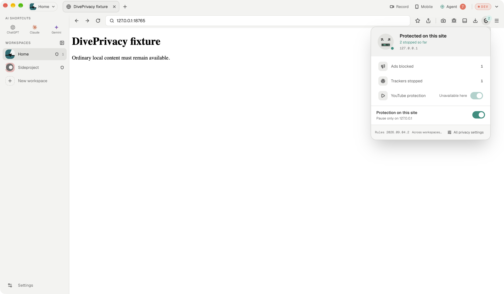
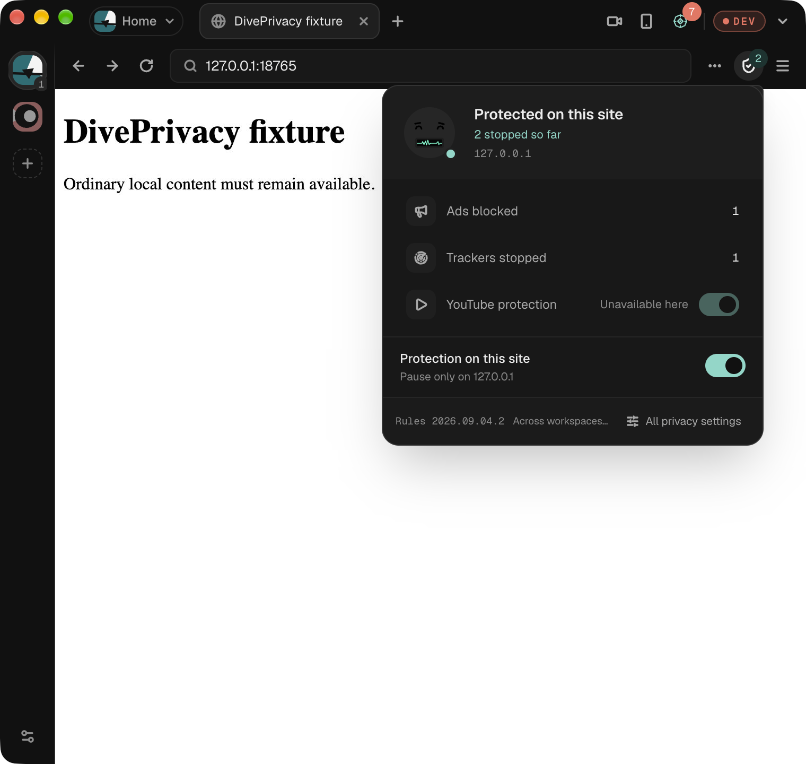

<p align="center">
  
</p>

<h1 align="center">Dive Browser</h1>

<p align="center">
  <strong>The developer-first desktop browser engineered for speed, AI autonomy, and distraction-free privacy.</strong>
</p>

<p align="center">
  <a href="https://github.com/ronaldxdale09/dive-browser/actions"></a>
  <a href="https://tauri.app"></a>
  <a href="https://www.rust-lang.org"></a>
  <a href="https://react.dev"></a>
  <a href="https://bitbucket.org/chromiumembedded/cef"></a>
  <a href="LICENSE"></a>
</p>

---

## 🌟 Overview

**Dive** is a native, keyboard-driven desktop browser built from the ground up for modern software engineers, technical founders, and designers.

Powered by a high-performance **Rust + Chromium Embedded Framework (CEF)** core and an ultra-responsive **React 19 + Tailwind CSS** chrome, Dive bridges the gap between everyday web browsing and deep developer workflows. It embeds an in-process Chrome DevTools Protocol (CDP) engine, a native Model Context Protocol (MCP) server for local AI agents, automated Playwright recording, an OpenAPI schema generator, and built-in privacy protections with zero extension overhead.

---

## 📸 Visual Showcase

### Primary Interface & Dark Theme
<p align="center">
  
</p>

### Built-in DivePrivacy™ & Distraction-Free YouTube
<p align="center">
  
</p>

### Workspace Rule Precedence & Request Interception
<p align="center">
  
</p>

### Appearance & Privacy Settings
<p align="center">
  
</p>

### Light Theme & Compact Navigation
<p align="center">
  
  
</p>

---

## ⚡ Key Features

### 1. 🧠 Built-In AI Agent & Native MCP Server
- **Sidecar Agent**: Integrated AI assistant with Anthropic & OpenAI streaming providers, live tool loop, page context awareness, and error diagnosis.
- **Model Context Protocol (MCP)**: Exposes browser capabilities (`page_state`, `page_click`, `page_type`, `network_list`, `console_tail`, `page_report`) over localhost HTTP with strict Bearer token authentication for Claude Desktop, Cursor, or custom agents.
- **Playwright Test Export**: Records manual browsing interactions or agent actions and exports deterministic Playwright test scripts with locator recommendations.

### 2. 🛡️ Native DivePrivacy™ Engine
- **Zero Extension Overhead**: Kernel-level network request filtering compiled directly into the Rust request pipeline.
- **Anti-Adblock & Tracker Shield**: Blocks surveillance beacons, fingerprinting scripts, and telemetry without breaking sites.
- **Distraction-Free Video**: Embedded container mode for video platforms stripping pre-roll ads, banners, and algorithmic feeds while preserving audio playback in background tabs.

### 3. 🛠️ Deep Developer Tooling
- **In-Process CDP Engine**: Direct Chromium DevTools Protocol client with sub-5ms p95 dispatch latency.
- **Network Panel & Traffic Analysis**: Capture full request lifecycles, inspect headers, view SSE/WebSocket frames, and export sessions as **HAR 1.2**.
- **Automated OpenAPI 3.1 Spec Generation**: Analyzes intercepted JSON API traffic and infers JSON Schema specifications for backend development.
- **Device Simulator**: Honest mobile and tablet viewports, customizable user agents, device pixel ratios, and network throttling presets (Offline, Slow 3G, Fast 3G).
- **Accessibility & Web Vitals**: Built-in **axe-core** accessibility auditor and Core Web Vitals (LCP, FID, CLS, INP) performance inspector.

### 4. 🗂️ Memory Saver & Workspace Management
- **Intelligent 30-Minute Idle Sweeping**: Automatically tears down native CEF webview processes for inactive tabs while keeping their tab chip, favicon, and session state.
- **State & Scroll Restoration**: Reactivating a sleeping tab immediately restores exact scroll position, viewport state, and navigation history from local SQLite.
- **Isolated Workspaces**: Separate tabs, cookies, and mock rules across personal, work, and client projects with instant keyboard switching.

### 5. 🚀 Production Push Update & Release System
- **One-Command Release**: Cut and publish updates with `pnpm release rc --push` or via GitHub Actions.
- **Seamless In-App Updates**: Built-in cryptographic verification via Tauri updater with zero-disruption background update checks and one-click restart.

---

## 🏗️ Architecture

```
dive-browser/
├── apps/
│   └── desktop/                  # Desktop application shell
│       ├── src/                  # React 19 UI Chrome (Tailwind, Zustand)
│       └── src-tauri/            # Tauri v2 Desktop Host & CEF Lifecycles (Rust)
├── crates/
│   ├── dive-agent/               # AI Agent runner, dialect parsing, tool dispatch
│   ├── dive-cdp/                 # High-speed in-process CDP client & transport
│   ├── dive-core/                # SQLite WAL database, migrations & event bus
│   ├── dive-integration/         # Multi-tier integration and stress test suites
│   └── dive-mcp/                 # Model Context Protocol HTTP Server
├── scripts/
│   └── release/                  # Unified release CLI & manifest synchronizer
└── .github/
    └── workflows/                # CI & Release GitHub Actions
```

---

## ⌨️ Essential Keyboard Shortcuts

| Shortcut (macOS) | Action |
|---|---|
| `⌘ T` | Open New Tab |
| `⌘ W` | Close Active Tab |
| `⌘ ⇧ T` | Restore Last Closed Tab |
| `⌘ 1` – `⌘ 9` | Switch to Tab 1–9 |
| `⌘ K` or `⌘ L` | Open Command Palette / Omnibar |
| `⌘ ⇧ R` | Start / Stop Video & GIF Tab Recording |
| `⌘ ⌥ I` | Toggle Developer Dock |
| `⌘ ⌥ A` | Toggle AI Sidecar Agent |
| `⌘ ⌥ M` | Toggle Device Simulator |
| `⌘ F` | Find in Page |
| `⌘ +` / `⌘ -` / `⌘ 0` | Per-Tab Zoom In / Out / Reset |

---

## 🚀 Getting Started

### Prerequisites
- **macOS** 13+ (Apple Silicon or Intel)
- **Node.js** $\ge$ 20 & **pnpm** $\ge$ 10.33.0
- **Rust** 1.84+ (2024 edition compatible)
- **CMake** & **Ninja** (required for native CEF bindings)

```bash
# macOS dependencies via Homebrew
brew install cmake ninja pnpm
```

### Installation & Development

```bash
# 1. Clone repository
git clone https://github.com/ronaldxdale09/dive-browser.git
cd dive-browser

# 2. Install workspace dependencies
pnpm install

# 3. Start local development (Vite + Tauri dev mode)
pnpm dev
```

---

## 🧪 Quality Gates & Testing

Dive Browser enforces strict zero-tolerance quality gates across all Rust and TypeScript layers:

```bash
# Run complete verification suite (Fmt, Typecheck, Lint, Vitest, Vite Build, Clippy, Cargo Tests)
pnpm check

# Run individual test suites
pnpm test          # 82 Vitest test suites, 580 tests (100% green)
pnpm typecheck     # TypeScript strict compilation
cargo test         # 360+ Rust tests across all 6 crates
cargo clippy       # Strict Rust linter (-D warnings)
```

---

## 🚢 Releasing & Push Updates

Dive makes releases effortless. You can cut and publish updates directly from your terminal or via GitHub Actions:

```bash
# Inspect next calculated semver release
pnpm release:check rc       # e.g. 0.1.1-rc.0
pnpm release:check patch    # e.g. 0.1.1
pnpm release:check minor    # e.g. 0.2.0

# Preview changes with dry-run
pnpm release rc --dry-run

# Cut, commit, tag, and push release in one command
pnpm release rc --push
```

Refer to [`RELEASING.md`](RELEASING.md) for full instructions on signing, notarization, and updater manifest distribution.

---

## 📄 License

Dive Browser is licensed under the [MIT License](LICENSE).
