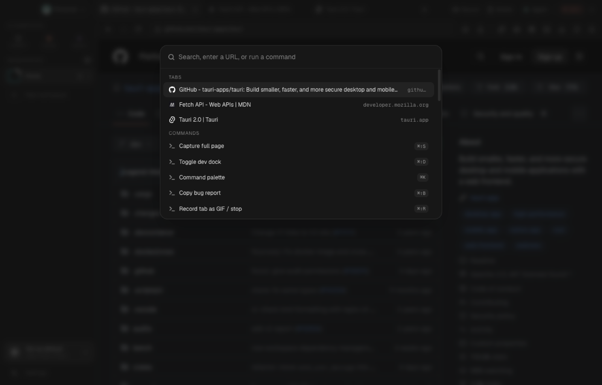
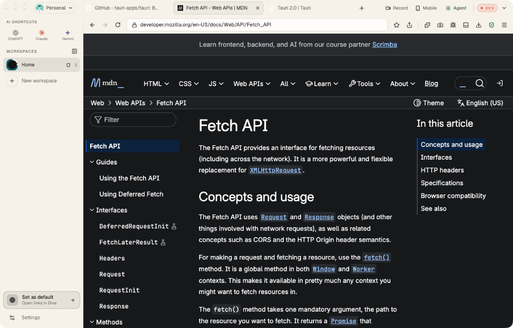

<p align="center">
  
</p>

<h1 align="center">Dive</h1>

<p align="center">
  <strong>A Chromium browser built for people who build the web.</strong><br />
  DevTools you can drive from a chat, an AI agent that sees the page, privacy that ships in the engine, and a screen studio for the demo you owe someone.
</p>

<p align="center">
  <a href="https://github.com/ronaldxdale09/dive-browser/releases/latest"></a>
  <a href="https://github.com/ronaldxdale09/dive-browser/actions/workflows/ci.yml"></a>
  <a href="https://bitbucket.org/chromiumembedded/cef"></a>
  <a href="https://tauri.app"></a>
  <a href="https://www.rust-lang.org"></a>
  <a href="LICENSE"></a>
</p>

<p align="center">
  
</p>

Dive is a native macOS browser on the Chromium Embedded Framework with a Rust core and a React chrome. It is fast, keyboard-first and private by default, and it turns the browser into a tool an engineer, a designer or an AI agent can operate.

## Why Dive

- **An agent that works the page.** Ask in the side panel and the agent reads the tab, clicks, types, inspects requests and reports back. Bring your own key for Anthropic, OpenAI, Google, OpenRouter, Groq, Mistral, DeepSeek, xAI and more, or run fully local with Ollama or LM Studio.
- **MCP built in.** Every tab is available to Claude Code, Cursor or any Model Context Protocol client over localhost with a bearer token: `page_state`, `page_markdown`, `page_click`, `page_type`, `page_screenshot`, `network_list`, `console_tail`, `tab_open` and more.
- **A developer dock, not a bolt-on.** Network with request bodies, SSE and WebSocket frames and HAR export. Console, storage, request rules, accessibility audits with axe-core, Core Web Vitals, page meta, and an OpenAPI 3.1 spec inferred from the JSON traffic you just watched. Full Chrome DevTools one shortcut away.
- **Device simulator.** Real phone and tablet frames, user agents, pixel ratios, touch, and Offline, Slow 3G and Fast 3G throttling.
- **DivePrivacy in the engine.** Ads, trackers and fingerprinting scripts are blocked in the Rust request pipeline with no extension. Per-site controls and a distraction-free video mode that keeps audio running in the background.
- **DiveScreen.** Record any tab as video or GIF, or import a recording, then crop, zoom, add cursor effects and export a clip that looks like a product demo.
- **Live subtitles.** On-device captions for any tab with whisper.cpp. Nothing leaves the machine.
- **Workspaces and profiles.** Separate cookies, tabs and mock rules per client or project, switchable with a keystroke. Profiles keep whole identities apart.
- **Mock and rewrite rules.** Intercept requests per workspace: mock a response, rewrite a host, or fail a call to see how the UI copes.
- **Light on memory.** Tabs idle for an hour drop their Chromium process and keep their chip, favicon, scroll position and history. Everything restores on click.
- **Bug reports with proof.** One shortcut captures a screenshot, the console problems and the failed requests into a Markdown report you can hand to a teammate.
- **Signed, notarized, self-updating.** Releases are notarized by Apple and verified in-app with a signed updater manifest.

## Screenshots

<table>
  <tr>
    <td width="50%"><br /><sub><b>Agent</b> reads the page and answers, here through a local Ollama model.</sub></td>
    <td width="50%"><br /><sub><b>DiveScreen</b> turns a tab recording into a demo with zooms and cursor effects.</sub></td>
  </tr>
  <tr>
    <td><br /><sub><b>Device simulator</b> with real frames, user agents and throttling.</sub></td>
    <td><br /><sub><b>DivePrivacy</b> blocking ads and trackers per site, in the engine.</sub></td>
  </tr>
  <tr>
    <td><br /><sub><b>Command palette</b> for tabs, history, bookmarks and every command.</sub></td>
    <td><br /><sub><b>Themes</b> from Graphite to Paper, or your own palette.</sub></td>
  </tr>
</table>

## Shortcuts

| Shortcut | Action |
|---|---|
| `⌘ K` | Command palette |
| `⌘ L` | Address bar |
| `⌘ T` / `⌘ W` / `⌘ ⇧ T` | New, close, reopen tab |
| `⌘ N` / `⌘ ⌥ N` | New window, move tab to its own window |
| `⌘ 1` – `⌘ 9` | Switch workspace |
| `⌘ J` | Agent |
| `⌘ ⇧ D` | Developer dock |
| `⌘ ⌥ I` | Chrome DevTools |
| `⌘ ⇧ M` | Device simulator |
| `⌘ ⇧ R` | Record tab |
| `⌘ ⇧ S` | Capture full page |
| `⌘ ⇧ U` | Live subtitles |
| `⌘ ⇧ B` | Bug report |
| `⌘ ⇧ N` | New workspace |
| `⌘ /` | Every shortcut, all editable in Settings |

## Install

Download the DMG from the [latest release](https://github.com/ronaldxdale09/dive-browser/releases/latest). macOS 13 or newer on Apple Silicon. Dive checks for updates and installs them in the background.

## Connect an agent

Dive serves MCP on `127.0.0.1:7391` and requires the token written to its data directory.

```bash
claude mcp add --transport http dive http://127.0.0.1:7391/mcp \
  --header "Authorization: Bearer $(cat ~/Library/Application\ Support/app.dive.browser/mcp-token)"
```

Cursor and other clients take the same URL and header. Settings → Developer shows the token path and the current port.

## Build from source

Needs Node 20+, pnpm 10, Rust 1.98+, CMake and Ninja.

```bash
brew install cmake ninja pnpm
git clone https://github.com/ronaldxdale09/dive-browser.git && cd dive-browser
pnpm install
export CEF_PATH="$HOME/.local/share/cef"   # CEF is downloaded here once (~500 MB)
pnpm dev
```

`pnpm check` runs the full gate: format, typecheck, lint, Vitest, Vite build, Clippy with warnings denied, and every Rust test. Build variants and the environment knobs (`DIVE_DATA_DIR`, `DIVE_MCP_PORT`, `DIVE_USE_MOCK_KEYCHAIN`, `DIVE_OPEN_URL`) are in [CONTRIBUTING.md](CONTRIBUTING.md).

## Under the hood

```
apps/desktop/          React 19 + Tailwind chrome, Tauri v2 host (Rust)
crates/dive-core       SQLite store, migrations, event bus
crates/dive-cdp        In-process Chrome DevTools Protocol client
crates/dive-mcp        Model Context Protocol server
crates/dive-agent      Agent runner and provider streaming
vendor/tauri-runtime-cef   Tauri's CEF runtime with local patches (see UPSTREAM.md)
```

Data lives in `~/Library/Application Support/app.dive.browser/`. Releases are cut with the script in `scripts/release/` and documented in [RELEASING.md](RELEASING.md).

## Contributing and license

See [CONTRIBUTING.md](CONTRIBUTING.md) for setup and conventions, and [SECURITY.md](SECURITY.md) for reporting vulnerabilities. Dive is MIT licensed and redistributes the Chromium Embedded Framework under its BSD-3-Clause license.
