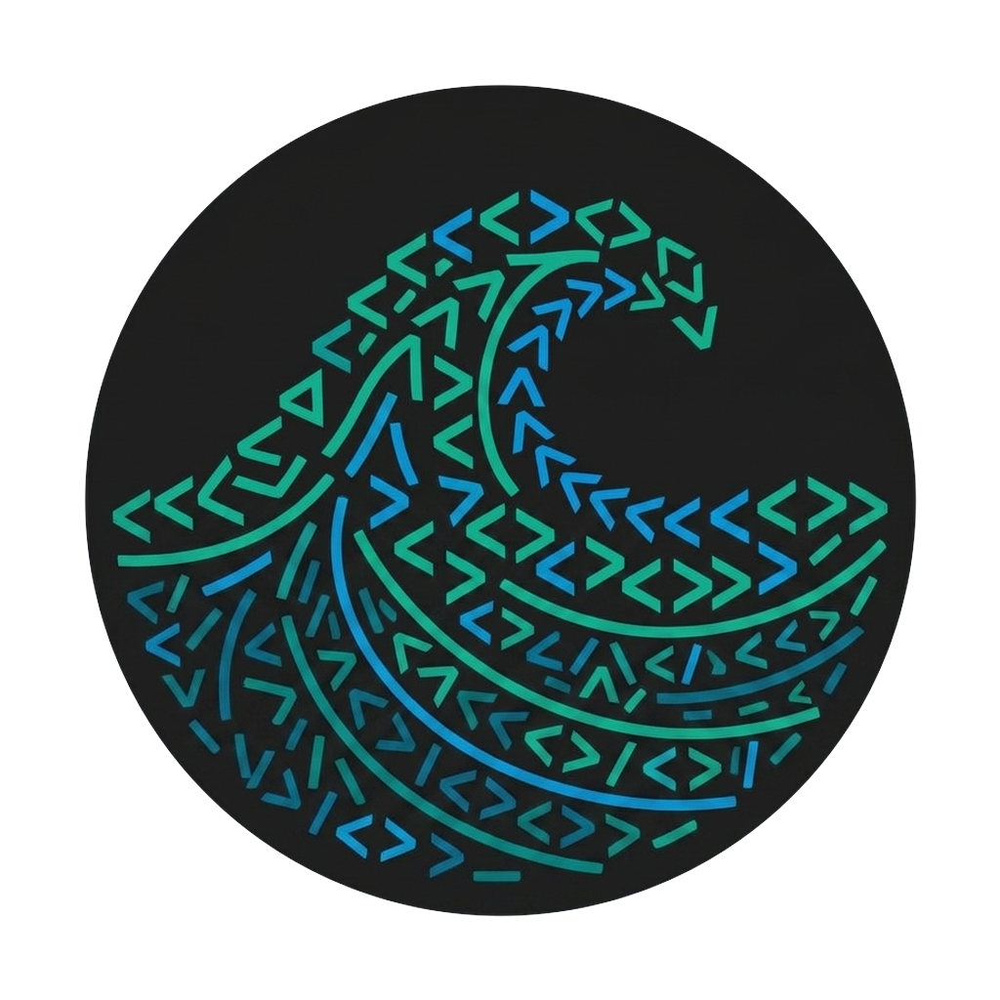
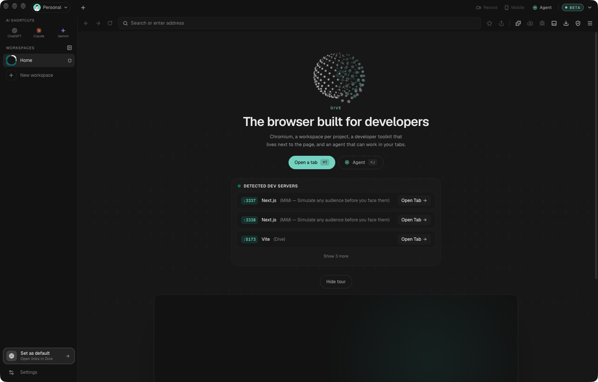
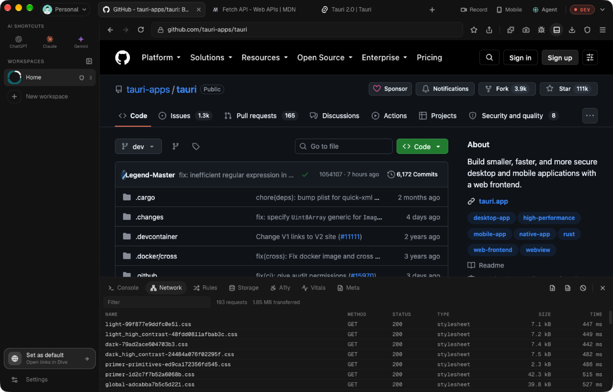
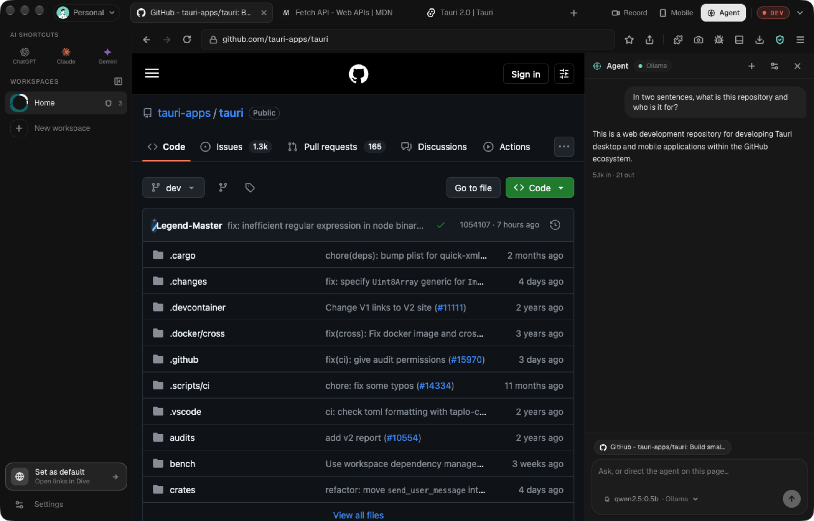
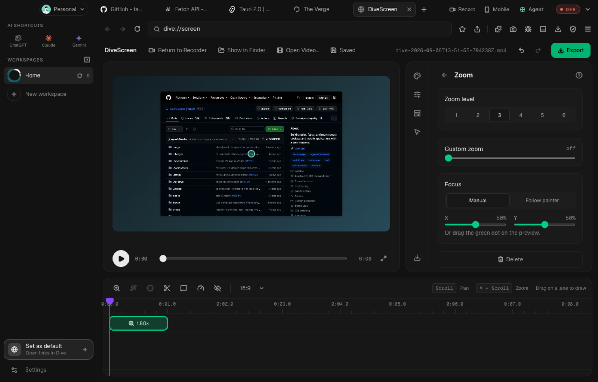
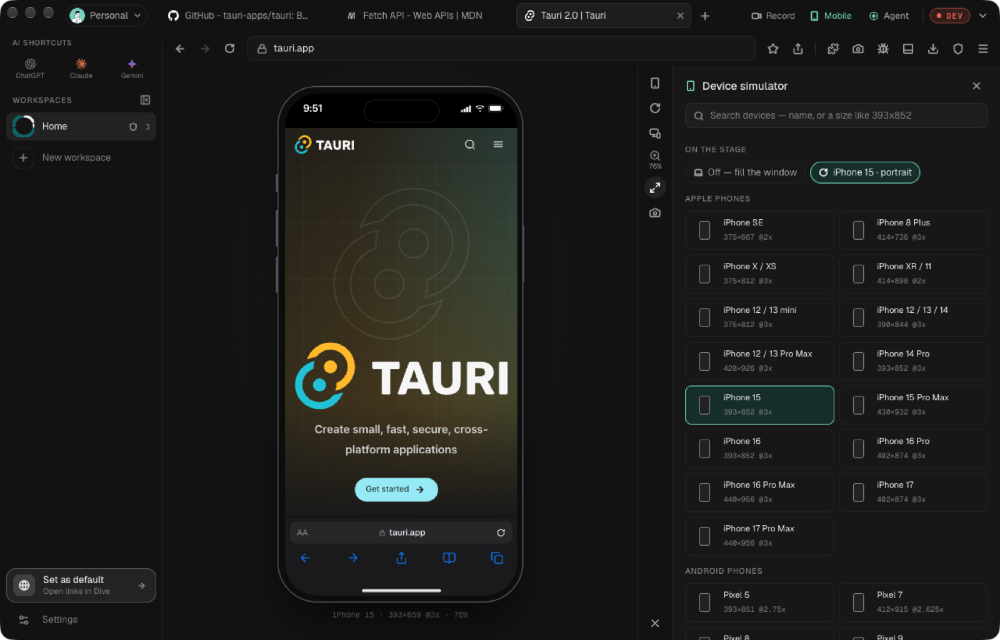
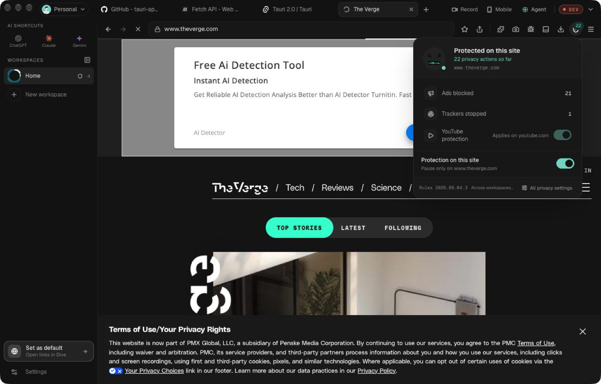

<p align="center">
  
</p>

<h1 align="center">Dive</h1>

<p align="center">
  <strong>The browser built for developers.</strong><br />
  Chromium, a workspace per project, a developer toolkit that lives next to the page, and an agent that can work in your tabs.
</p>

<p align="center">
  <a href="https://github.com/ronaldxdale09/dive-browser/releases/latest"></a>
  &nbsp;
  <a href="https://github.com/ronaldxdale09/dive-browser/releases/latest"></a>
</p>

<p align="center">
  <a href="https://github.com/ronaldxdale09/dive-browser/releases/latest"></a>
  <a href="https://github.com/ronaldxdale09/dive-browser/actions/workflows/ci.yml"></a>
  <a href="https://github.com/ronaldxdale09/dive-browser/releases"></a>
  <a href="LICENSE"></a>
  <br />
  <a href="https://bitbucket.org/chromiumembedded/cef"></a>
  <a href="https://tauri.app"></a>
  <a href="https://www.rust-lang.org"></a>
  <a href="https://react.dev"></a>
  <a href="https://www.typescriptlang.org"></a>
  <a href="https://modelcontextprotocol.io"></a>
  
</p>

<p align="center">
  
</p>

Dive is a native browser for macOS and Windows, built on the Chromium Embedded Framework, with a Rust core and a React chrome. It is fast, keyboard-first and private by default. The difference is what sits beside the page: network, console, storage and accessibility panels, a device simulator, a screen studio, and an AI agent that can read and operate the tab. Every tab is also reachable by Claude Code, Cursor or any MCP client.

## What you get

- **An agent in the side panel.** It reads the page, clicks, types, inspects requests and reports back. Bring your own key for Anthropic, OpenAI, Google, OpenRouter, Groq, Mistral, DeepSeek or xAI, or run fully local with Ollama or LM Studio.
- **MCP built in.** Claude Code, Cursor and other Model Context Protocol clients can open tabs, read pages, click, type, take screenshots and tail the console and network over localhost, behind a bearer token.
- **A developer dock, not a bolt-on.** Network with request bodies, SSE and WebSocket frames and HAR export. Console, storage, request mocking and rewriting, axe-core accessibility audits, Core Web Vitals, and an OpenAPI spec inferred from the traffic you just watched. Full Chrome DevTools one shortcut away.
- **Device simulator.** Real phone and tablet frames, user agents, pixel ratios, touch, and Offline, Slow 3G and Fast 3G throttling.
- **DivePrivacy.** Ads, trackers and fingerprinting scripts are blocked in the engine's request pipeline, with per-site controls. No extension needed.
- **DiveScreen.** Record any tab as video or GIF, then crop, zoom and add cursor effects to make a clip that looks like a product demo.
- **Workspaces and profiles.** Separate cookies, tabs and mock rules per project, switchable with a keystroke. Profiles keep whole identities apart. Private windows run in their own process.
- **Light on memory.** Idle tabs drop their Chromium process and keep their place; everything restores on click.
- **Sites as apps.** When a page's manifest passes Chrome's install rules, an install button appears beside the address. The tab becomes the app's own window — no tabs, no address bar, the app's icon in the title bar — and a launcher lands in `~/Applications/Dive Apps` for Spotlight and the Dock. Leave the app's scope and a thin bar offers the site back in Dive.

## Screenshots

<table>
  <tr>
    <td colspan="2"><br /><sub><b>Developer dock</b> with the Network panel open beside the page.</sub></td>
  </tr>
  <tr>
    <td width="50%"><br /><sub><b>Agent</b> reading the page, here through a local Ollama model.</sub></td>
    <td width="50%"><br /><sub><b>DiveScreen</b> turning a tab recording into a demo.</sub></td>
  </tr>
  <tr>
    <td><br /><sub><b>Device simulator</b> with real frames and throttling.</sub></td>
    <td><br /><sub><b>DivePrivacy</b> blocking ads and trackers per site.</sub></td>
  </tr>
</table>

## Install

| Platform | |
|---|---|
| macOS 13 or newer, Apple Silicon | [Download the DMG](https://github.com/ronaldxdale09/dive-browser/releases/latest) |
| Windows 10 or newer, x64 | [Download the installer](https://github.com/ronaldxdale09/dive-browser/releases/latest) |

Dive checks for updates and installs them in the background.

macOS builds are signed with an Apple Developer ID certificate and notarized.
Windows builds are being set up for code signing through the
[SignPath Foundation](https://signpath.org/)'s free program for open-source
projects; see [docs/CODE_SIGNING.md](docs/CODE_SIGNING.md) for the policy.
Until that certificate is issued the Windows installer is unsigned, so
SmartScreen warns the first time you run it: choose **More info**, then **Run
anyway**.

## Connect an agent

Dive serves MCP on `127.0.0.1:7391` and requires the token it writes to its data directory.

```bash
claude mcp add --transport http dive http://127.0.0.1:7391/mcp \
  --header "Authorization: Bearer $(cat ~/Library/Application\ Support/app.dive.browser/mcp-token)"
```

On Windows the token is under `%APPDATA%\dive\mcp-token`:

```powershell
claude mcp add --transport http dive http://127.0.0.1:7391/mcp `
  --header "Authorization: Bearer $(Get-Content $env:APPDATA\dive\mcp-token)"
```

Cursor and other clients take the same URL and header. Settings › Developer shows the token path and the current port.

## Build from source

Needs Node 20+, pnpm 10, Rust 1.98+, CMake and Ninja.

```bash
brew install cmake ninja pnpm
git clone https://github.com/ronaldxdale09/dive-browser.git && cd dive-browser
pnpm install
export CEF_PATH="$HOME/.local/share/cef"   # CEF is downloaded here once (~500 MB)
pnpm dev
```

Windows needs the MSVC toolchain and one extra environment variable so
whisper.cpp and CEF agree on a C++ runtime; [docs/WINDOWS.md](docs/WINDOWS.md)
has the setup and the reasoning.

`pnpm check` runs the full gate. Layout, environment knobs and conventions are in [CONTRIBUTING.md](CONTRIBUTING.md); design notes and measurements are under [docs/](docs/README.md).

## License

Dive is [MIT licensed](LICENSE) and redistributes the Chromium Embedded Framework under its BSD-3-Clause license. To report a vulnerability, see [SECURITY.md](SECURITY.md).
